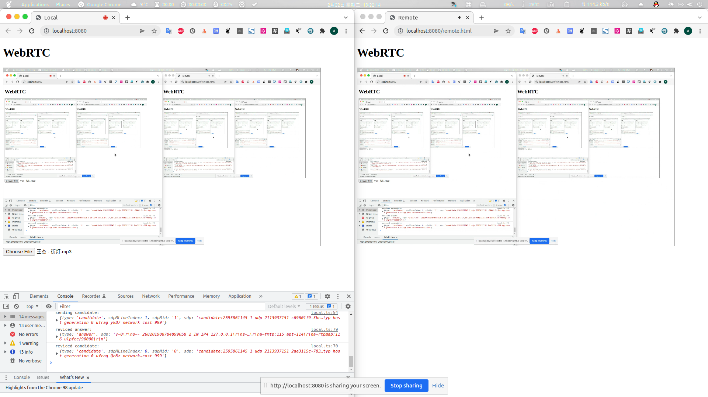

# WebRTC example with typescript
- Share your Screen and Audio by WebRTC. 
- Exchange webRTC ICE,ANSWER,OFFER by websocket

## Usage
First. start websocket server by clone project [webrtc-stun](https://github.com/huangyanxiong01/webrtc-stun) to your computer.

```shell
git clone git@github.com:huangyanxiong01/webrtc-typescirpt.git
pnpm install
pnpm start
```

Now.open `http://localhost:8080/` and `http://localhost:8080/remote.html` in your browser.

## Screenshot


## Limitations
- The user needs to opt in to sharing system sounds in the Chrome screen sharing dialog
- On Chrome for macOS & Linux it is only possible to share your audio when choosing to capture a Chrome tab
- Firefox does not yet support capturing for system sounds
